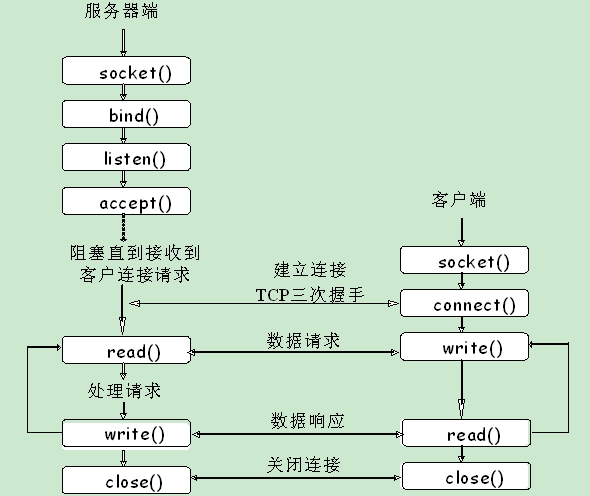

### **面试日程：** 

| 公司 | 应聘岗位 |面试时间段 |
| :------------- |:-------------|:-------------|
|[蚂蚁金服](#mayijinfu) |后台开发| 2017/07/12 ~ 2017/07/17(over) |
|[华为竞赛专场](#huawei) |软开| 2017.07/15 ~ 2017.07/18 |
|[腾讯上海](#tencent_shanghai) | 游戏服务器开发 | 2017/07/28 ~ 2017/08/09（over） |
|[百度上海](#baidu_shanghai) | 运维 | 2017/08/08 ~ over |
|[宜高美](#yigaomei) | 算法实现(C++) | 2017/08/12 ~ 2017/8/17  |
|[多益网络](#duoyi) | 人工智能及大数据研发工程师 | 2017/8/26~2017/9/14 | 
|[搜狗](#sougou) | 算法工程师 | 2017/9/12 ~ |
 
----
### <a id="mayijinfu"> 蚂蚁金服 </a>
阿里的蚂蚁金服是求人家内推的，面试时间也比较早，大概在7月中旬就开始内推了。是我的处女面，也是比较悲催的处女面。走到一面就over了。

#### **在线编程测试：** 
在线编程测试题目相对还比较简单，半小时，一道题。
- **大致题意：** 给定一个数组inputs，从中任选两个数之差的绝对值构成A集合，任选两个数之和构成B集合。然后从A中B中分别任选一个数之差的绝对值构成D集合，输出D中最大值，最小值以及D的size之和。
- **求解思路：** 由于时间问题，没做太多的思考，直接用三个集合对整个过程进行模拟，得到结果。算法复杂度。

#### **电话面：** 
阿里不知道是不是喜欢突然袭击，当时大致下午5点50左右了，正走在吃饭的路上，来了电话。并要求尽量当时面试，不要另约时间。既然人家这么说了，我也就老老实实的当场面了。面试总时间半个小时，内容大概分三块：
- **工程经验：** <br>
	调试技巧，Bug定位，以前项目中遇到过的困难，解决该困难的思路等等；
- **计算机基础知识：** <br>	 
	- 最基本的Socket服务器客服端模型 (图片来自网络)；
	 <br> 
	- 宏定义的缺点：参考Blog中[条款二](http://blog.csdn.net/qqmindyourwill/article/details/52276505)；<br>
	- 虚函数的作用：动态多态；<br>
	- 子类被delete时会调用父类析构函数么：会。这里有个相关的点——如果delete的指针如果是一个父类指针指向子类，就需要父类的**析构函数是虚函数**，才能成功调用到子类的析构函数，否则只会析构父类的部分，导致内存泄露。所以，如果设计的类只要有被继承的可能，那就尽量将其析构函数设置为虚函数。<br>
	- 是否熟悉Linux，是否会写makefile？<br>
	- fork()返回两次的实现原理？[参考文章。](http://blog.csdn.net/barfoo/article/details/1626938)<br>
	- fork()创建子进程的具体过程？[参考文章。](http://blog.csdn.net/yangcs2009/article/details/39267733) <br>
	- 大致就这些吧，其他问题不记得了。
	
- **算法：** <br>
    - 设计一个栈，使得其push、pop、以及返回当前栈中最小值的时间复杂度都为：当时没搞出来（捂脸哭）。后来发现就是《剑指offer》上面的一道题，答案请[参考](https://github.com/ChirlChen/AcceptedCode/blob/master/NowCoder/CodingInterviews/20.h)。 <br>
    - 给8个球，有一个重量跟其他7个不一样，有可能轻了，有可能重了。问给你一个天平，怎么分三次将有问题的球找出来？第一直觉就是二分，结果发现第一次二分称完，完全得不到信息。思路又特别混乱，想了半天，脑袋一片空白，越想越慌，遂放弃之。 <br>
其实按照上面的思路，第一次二分就不称了，接下来**第一次：** 在天平两端一边放两个球，**如果平了，** 就证明有问题的球在没称那堆里面，可以用当前已称的球做标准去找问题球。**第二次：** 从没称的球中拿出两个当做标准球替换天平上一端的两个球，**如果平了**，就证明问题球在剩下没称的球中，那在没称的球中拿出一个，天平上去掉3个球，留一个做标准球，进行**第三次，** 平了那问题球就是剩下的最后那个球。没平就证明刚拿上来的球是问题球，遂得到解。其他情况跟前面的思路一致，主要就是利用称完得到的额外信息，来辅助找问题球。。

#### 总结：
一面秒跪，当时感觉工程经验和基础知识面得还可以，主要就跪在了算法问题上，其实挺简单的两个题，结果因为面腾讯，得失感太重。一紧张，脑袋一片空白，完全没法正常思考。所以不论面试什么公司，**平常心很重要呀。** 另外，当时接到电话后，还傻逼的往外面走，去吃饭，结果面试环境也嘈杂，还需要中途跟同学交流点餐啥的，也很影响面试，所以说**面试环境也极为重要。** 尽量找一个相对安静，不会分心的地方为佳。

----
### <a id="huawei">  华为竞赛专场 </a>
华为参加过软挑，进64的同学便可以获得一个7月份的招聘门票。这次的华为面试主要分为两阶段：综合测评+面试。

#### **综合测评：** 
就是做一些心里测试题，基本按着吃苦耐劳、团队奉献、和谐友善的方向选，都没什么问题。

#### **面试：** 
这次面试分两轮，在一天内完成。
   - **技术面：** 可能是竞赛专场，大家在竞赛中就算通过基本的技术测试了的缘故，面试官都没有问太多基础知识，更多的是让你聊项目，从你的项目中去挖掘一些点来问。大致想透过聊天，看你的语言表达、思维逻辑以及对做过的项目认知深刻度这些能力吧。
   
- **综合面：** 这一面大多数同学进去都是跟面试官聊天，谈人生、谈理想、谈职业规划啥的，有的面试官也会问点技术。也不知道面试官具体的考察点是啥，反正就自由发挥了，管他的，聊得开心就好。当然聊到一些关键性问题的时候还是自己稍微注意一下，不要太随性，**同时还需要平时做点功课**。比如说，你对华为有什么了解？公司文化是什么，这样的文化有什么优缺点？你赞同这样的文化吗？
   
华为这边的面试基本就这样了，虽然中间被面试官挖了几次坑，勉强给应付过去了，但总的来说面试还算轻松。最后7月底通知的结果来看，面试刷的人也不多，然后绝大部分都进化粪池待着了，等着捞吧，期望能过。

----
### <a id="tencent_shanghai"> 腾讯上海</a>
腾讯这边通过内推投了他们的校招游戏提前批，投完简历，在官网完善简历几天后，收到了他们的电话面试预约，然后就约了他们指定的时间。这次因为实验室同学说也想听听面试集体内容，就选择了在实验室进行电话面。当前进度：电话1面。很久没消息了，**已跪。**

####  **电话1面：** 
主要问的问题偏向于对知识的理解类型，问了C++、设计模式、操作系统、网络编程这几个方面的一些基础知识；
- **C++相关：** <br>
    - C++的优缺点是什么？ 基于个人平时有用C++、Python、Matlab，就对C++本身优缺点，以及与这两门语言相对的优缺点，做了简单的比较。<br>
     答：<br>
    **缺点：**<br> 
    **(1)** C++是一个包含了C、面向对象、模板编程等多方面语言特性的集合体，知识面太多，这使得C++学习起来有很大的难度，对C++程序员造成了很大的负担。 <br>
    **(2)** 由于C++由C拓展而来，比较偏计算机底层、需要程序员自己去操作指针，管理内存。虽然现在也有智能指针这样的自动内存管理库，但是对程序员来说仍然有很大的负担。 <br>
    **(3)** 由于C++引入了面向对象的特性。与C相比，其虚函数，虚继承等都会带来额外的内存开销，以及动态多态带来的的编译期确定函数调用绑定推迟到了运行期，从而导致一定的额外效率开销。 <br>
    **(4)** 由于没有像Python那样的内置数据结构(元组、列表、字典)，而依赖于STL，其声明和使用都比较麻烦。<br>
    **(5)** 其语法也不像Matlab那样，很自然易懂，学起来相对晦涩。 <br>
    **优点：**<br>
    **(1)** 基于上面第一点，也正是由于C++的恢弘磅礴，使得C++非常灵活，可适用于绝大多数开发场景。 <br>
    **(2)** 与面向过程相比，C++面向对象的特性，使得程序对现实世界的描述更加合理。也有利于设计出易扩展、易维护、高复用、低耦合的系统。 <br>
    **(3)** 也因为它更偏向底层，所以程序员能随心所欲的操作计算机资源，有利于资源更合理的管理。<br>

    - 如果你作为项目负责人，新负责一个项目，怎么选择开发语言？
      答：以我的个人经验来看，大致可以从三方面考虑，项目对语言效率的要求、项目开发周期、以及所选语言对该项目所需的框架支持情况。	   <br>
    - C、C++他们分别适用的项目类型？ 
    答：C语言更适合做嵌入式，操作系统的开发；C++更适合开发大型软件，像PS、Chrome、游戏服务器等等；	  <br>
    - 模板编程的优缺点？ <br>
  
    - C++的编译过程分哪些阶段？[参考文章](http://www.cnblogs.com/mickole/articles/3659112.html)	   <br>
    - 动态链接和静态链接的区别？[参考文章](http://www.cnblogs.com/mickole/articles/3659112.html) <br>

- **操作系统：** <br>
    - 进程的内存分布？[参考文章](http://www.cnblogs.com/Lynn-Zhang/p/5449199.html) <br>
    - malloc申请的内存在那个区？自由存储区； <br>
    - 进程间通信？[参考文章](http://blog.csdn.net/u014774781/article/details/45485735) <br>
    - 进程通信的信号中哪些信号是可拦截的？ <br>
    - Linux下开发调试经验（GDB使用、Bug定位等等）？ <br>
  
- **网络编程：** <br>
    - 基本的socket用法？ [参考文章](http://blog.csdn.net/hguisu/article/details/38638183#t5) <br>
    - 是否用过非阻塞模型？select、poll与epoll的区别？ [参考文章](http://blog.csdn.net/hguisu/article/details/38638183#t5) <br>
	 
- **设计模式：** <br>
    - 平常用过哪些设计模式？ <br>
    - 简单描述单例模式的实现方式？<br>

----
### <a id="baidu_shanghai"> 百度上海 </a>
 百度之前投内推记得是投的软开，但是收到的电面是说让面运维，虽然有点诧异，但是管他呢，能面就先面了。目前进度：电话1面、电话2面。很久没消息了，**已跪**。
 
#### **电面1：** 
电面一开始也是让做一个简单的自我介绍，然后就根据自我介绍和投的简历展开了面试。主要问的问题包括：通信协议、C++和Python基础、算法基础、项目介绍；
-  **通信协议：**  <br>
    - OSI七层模型描述： <br>
     
    - TCP、UDP区别？适用场景？ <br>
     
    - TCP、UDP、IP、HTTP分别属于OSI的那一层？ <br>
     
    - HTTP各种状态码的意义？在传输层是用的那个协议？ <br>
    
    - 其他不太记得了。。。 <br>
 
- **C++和Python基础：** <br>
 
    - 简述C++多态。多态的应用场景？ <br>
 
    - Python的内置数据结构有哪些？ <br>
  
    - 元组和列表的区别？运用场景？ <br>
  
    - Python的模块中为什么要加 if \_\_name\_\_ == '\_\_main\_\_': <br>
  
    - 怎样写一个Python模块？<br>
  
- **算法基础：** <br>
  
    - 深度优先、广度优先简述？ <br>
  
    - 分别用递归和非递归方式实现深度优先和广度优先？ <br>
  
    - 简述快排？快排的平均时间复杂度和最差时间复杂度？为什么？ <br>

#### **电面2：** 
开始让做一个自我介绍，然后主要问项目和算法。<br>
- **项目：** 让讲一个自己最熟悉的项目，然后一边讲，面试官一边进行提问。我主要从以下三个方面在讲述：
    - 该项目解决的什么问题？
    - 我用了什么算法去解决？ 
    - 最终得到的效果。<br>

    面试官中间根据描述，问了一些细节，稍不注意就会被自己坑到。所以对于自己讲的东西，最好是弄到能了如指掌，不会的东西，最好是别讲。

- **项目拓展：** 然后面试官就提出了一个相关的项目。
    - 处理百度的网络请求，网络请求可以分成很多；类别，比如：重要搜索请求，普通搜索请求，攻击流量等得。现在已经有了相关的流量包，怎么对他们进行处理，识别（分类）出具体哪些流量属于哪一类？ 
    - 然后假设已经有了这个分类模块，由于服务器负载能力问题，需要优先处理重要的请求，抛弃不重要的。具体从架构上怎么去设计，然后怎么实现。这问题完全是跟着感觉走，都不晓得怎么答[捂脸]，胡说了一通。<br>

- **算法：** <br>
    - **马踏棋盘问题**，说是在棋盘上，有一个象棋——马，然后给定一个终点，怎么用最少的步数从起点走到终点。
        答：这道题听完之后，感觉有点思路，想着用贪心的方式，一直沿着向终点靠近的方向走。面试官就给了个特例，起点和终点相邻，然后就发现上面的思路会变成死循环。后来经过面试官提示，马在每个点都有8个可选落点（忽略边角情况），将棋盘的落点作为图的一个节点，马一步跨越的长度作为边的权重（这里都是1），然后可以将其想象成一个出度基本都为8的图。接着就变成了一个寻最短路的问题。
        网上马踏棋盘的算法有很多，看了一下，基本都是用贪心思想做的，他的贪心思路主要是：每次马选的落点是所有可选落点中出口最少的点。但是这类解法似乎只能求出一条次优解，不过结合回溯就能得到最优解了(但是回溯遍历完所有结果，似乎代价有点大)。

    - **迷宫问题**，给你一个迷宫，怎么样找到入口到出口最短的一条路。 
        答：把迷宫整个映射成一个图结构，每条路的拐角作为图的节点，两个拐角间的距离作为图的边权重，然后就类比成了一个图中最短路问题。用**Dijkstra**算法的思想，就能求到最短路了。


----
### <a id="yigaomei">  宜高美 </a>   
 宜高美内推后，分了好几批进行面试，我是等了好久，应该是第3批才等到通知的，应该属于比较晚的一批了。由于公司就在成都软件园那边，所以是直接到公司进行面试。面试一共分4个环节，包括：笔试、技术面、英语面、HR面；
 
#### **笔试：** <br>
分不同岗位笔试的题目不同，由于我面的是算法实现（据说主要负责公司业务算法的研究和C++实现），所以面试的题目主要内容都是智力题、数学题类型的。比如说：烧一根材质不均匀的绳子需要一小时，那么怎么判断半小时。

#### **技术面：** <br>
 技术面主要就问了项目，可能是面试官恰好是做算法的，而我的项目又恰好是算法方面的，所以面试官一直在问项目相关的东西，然后问一些数学知识，比如说贝叶斯公式、最大似然啥的，最后也问了一点简单的C++基础。项目就不谈了，简单说说问的两个C++基础题吧。
- **C++基础：** <br>
    - 在类中声明const、static、static const类型的成员变量，这三者有什么区别？
	答：首先是存储位置：const类型存储在常量区、static类型存储在全局/静态区。然后是初始化方式不同，static类型在.cpp中定义和初始化、const类型在构造函数的处理化列表中初始化，static const int 类型可以直接在类体内定义及初始化，其他static const类型也必须在.cpp中定义和初始化。<br>	
    - 面试官写了一个函数，考察了一下指针的用法。
	
	``` C++ 
	int *func(int *a, int *b){
		int *c = *a + *b; return c; //1、是否有问题，错在哪儿？等号左右两边类型不匹配。
		int *c; *c = *a + *b;return c; //2、是否有问题，错在哪儿？c没有内存，内存访问错误。
		int c = *a + *b; return &c; //3、是否有问题，错在哪儿？c为栈空间的局部变量，函数返回后内存被释放，返回其地址并没有意义。 
	}
	```
		
#### **英语面：** <br>
 由于宜高美是一家外企，所以对于英语能力似乎还挺看重的，英语面试一名老外面的，我整个过程就在跟老外聊自己的项目：高维张量补全算法。他提问，我就逐步回答，一边写公式一边磕磕绊绊的说着自己的蹩脚英语。整个过程大概30分钟吧，基本把自己算法解决的什么问题，用了什么算法，算法目标函数以及这么构建的原因这几点讲明白了。中间的表达，挫的自己都不敢相信，但是还是要大胆的说，人家连蒙带猜也还是能懂你在说啥。<br>
 
#### **HR面：** <br>
  这一面进去就让做一个**1分钟**的自我介绍，HR好特地对一分钟加了重音，我感觉好像掐时间会比较重要（不晓得是不是想多了），短时间，讲重点。然后就各种问，比如说：期待的办公环境呀？老家哪儿的呀？为什么不回家工作呀？工作以后万一发现实际工作跟自己想象不是那么匹配你该怎么办？对自己做一个简单的评价等等。

 
#### **总结：** 
宜高美的整个面试过程说来还算轻松。其中两个比较蛋疼的地方是：一个是笔试题好几道智力题，之前没做过，只大致答上来了一些。另一个是英语面确实有点捉急。后来听他们说好多智力题之前人家就在[牛客网](https://www.nowcoder.com/intelligentTest)数学和逻辑专栏上刷过的，看来自己也得刷一刷。英语的话，短时间也没办法了，以后再有这样的，只能说面试前做点准备，不要再这么菜。最后就只希望过一段时间能收到好消息了，求过。
  
----
### <a id="duoyi"> 多益网络 </a>

#### 视频一面
多益通过QQ进行的视频面试。整个过程大概20几分钟，问得虽然比较简单，不过自己答得还是不怎么样。中间面试官略提及了一下之前在他们公司实习过的事情，不过也只是简单提了一下，感觉他并不太感兴趣，没有什么卵用。主要面试过程如下：
- 自我介绍，说到了自己的研究方向是做大数据方面的高维缺失数据恢复，然后自己的兴趣是程序开发。结合自己的兴趣和研究方向，就来面大数据研发工程师了。面试官就接着我介绍的两方面进行了展开。
- 研究方向相关：数据恢复是处理的什么样的数据，用的什么算法，其中的原理。
- 熟悉机器学习算法吗？讲讲K-Means聚类过程。K-Means初始化类中心有什么局限或则缺点吗？
- 概率题：一副牌中除去大小王，剩下52张牌中随机抽出两张，红、黑牌各一张的概率是多少？ 
    - 答：分母第一次从52张里面抽出1张，第二次从51张里面抽出1张，所以就是。分子如果第一次抽出红牌，第二次抽出黑牌，就是 ，反过来第一次抽出黑牌，第二次抽出红牌，也是 。 所以最后概率为：   。 麻蛋，当时面试没有乘2，答了个。
-  进程与线程的区别？
    - 答：
        1. 进程有自己独立的地址空间，线程有自己的堆栈和局部变量，但是没有独立的内存空间，多个线程共享内存；
        2. 线程尺度小于进程，一个应用程序至少有一个进程，一个进程至少有一个线程；
        3. 线程切换的开销比进程小，多线程程序并发性更高。但是多线程不利于资源的管理和保护，进程相反。
        
-  线程切换过程中，都进行了那些操作？ [参考答案](http://www.cnblogs.com/binyue/p/4484783.html)
 
-  接下来一个简单算法题：给定一个字典字符串A，一个子字符串B，问求B中的字符是否都在A中出现过的算法。然后把该算法写出来发给他。
    -  答：
        -  先说了**暴力法，** 对B中的字符依次遍历，去A中查找是否出现过。复杂度为   。<br>
        - 然后面试官说**不暴力** 怎么做，接下来就自己就默默的举了个例子，一看可以通过Hash的方式，用一个数组对A中出现过的字母进行映射记录是否出现过（出现过记录为1，否则0），然后遍历B字符串中的字符，去数组中对应位置检验该字母是否出现过，检验失败就返回false。遍历完成就返回true。算法复杂度优化为**O(m+n)** 。
- 怎么看待加班问题？
    - 答：主要从目前国内互联网环境方面和自己得失方面进行了回答，另外还举了个研究生期间996的实例说明自己加班加得很爽[捂脸哭]。

----
### <a id="sougou"> 搜狗 </a>
#### 电话面
搜狗笔试完了大概一两天就通知面试了，还是很高效的（赞）。由于搜狗投的算法岗，电话面主要内容也都落在了**机器学习，神经网络**的问题上。但是个人的基础比较菜，整个过程基本是问什么不知道什么，但是面试官人非常好，好几处不知道的都给讲了答案，然后还尴尬的一直安慰“没关系，这个不重要”。大概面试过程如下：
- 自我介绍：还是像前面多益面试一样，主要强调了自己的学术背景，然后与自己的软开经历结合。表明自己具有算法基础，也有编程经验。
- 然后面试官就问了简历写的**朴素贝叶斯做网络流量分类**的项目。
    - 问项目背景，数据是什么？分类目的是什么？
    - 然后关于朴素贝叶斯算法本身。如果模型训练好了，但是在新数据到来，进行分类的时候，发现该条样本有些特征的值为空，那该怎么处理才能对其合理分类？
    - 然后如果对于新到来的数据，其特征数比模型中训练的特征数目更多，比如说文本分类，咋们的模型不可能包含所有的特性词组，新到来的样本恰好就多了一些原始模型中没有的词组。那怎么合理处理这条样本？<br>
    
    这两个问题，第一个特征值为空之前倒是遇到过，直接将其概率设置为1，当时想的是消除这条特征的影响。面试官说不对，应该怎么怎么滴（当时也没听明白[捂脸]）。然后第二个问题，简单说了一下自己处理的想法，面试官也说不对，应该怎么怎么滴（大体意思是贝叶斯有一个操作是对这种特征进行平滑，将其概率设置为：1/特征数。）
- 然后问**神经网络**，都了解哪些神经网络模型，分别讲讲他们的基本流程。因为我简单讲了CNN、RNN，然后面试官对RNN就特别感兴趣，一溜问：
    - recurrent neural network 与 recursive neural network的区别？[参考知乎上的问题答案](https://www.zhihu.com/question/36824148)
    - LSTM是用来干啥的（用来解决普通RNN历史信息逐层消失的问题）？他的核心原理是什么？
    - 我们知道激活函数包括：softmax、ReLU、tanh、二次函数之类的，那么RNN的激活函数一般采用哪种？推导过RNN吗？为什么不用二次函数（说是二次函数梯度下降很慢，导致迭代收敛很慢）？<br>
    
    这几个问题基本都被问懵逼了，只能不断表示自己不知道，这个模型只是大致看了看文献，了解了一下。面试官又一通安慰，当时自己感觉炒鸡不好意思面对这么好的面试官了，感觉自己就是在折磨面试官[苦笑]。
- 面试官想了想，实在不知道问啥了，就说：“要不你给我讲讲你的**高维VSP数据正则化的项目**吧，虽然我也不一定能明白。”[无穷苦笑]
    - 还好，自己从项目背景，到基本原理，怎么建立目标函数，怎么加正则化项解决目标函数病态问题，基本求解，迭代求最优解。一通讲下来，敢觉这部分跟面试官讲的还算清晰。
 
最后基本这部分讲完，整个面试过程也就结束了，当时心想绝壁洗白了。但是晚上竟然收到了第二天的现场面试通知。倍感荣幸，可能面试官也主要看在我最后一部分还行的份上让过了吧（感谢面试官）。

#### 二面
二面在天府软件园腾讯大楼B栋去参加的现场面，面试官人也挺不错，人很随和，刚开始还简单的聊了聊找工作忙不忙，成都软件园不错啥的（聊天发现面试官应该是北京过来出差面试的）。营造的面试氛围很轻松。
- 首先自我介绍。回答同上，然后面试官看我熟悉C++，后面就主要是C++的问题了。
- **类的析构函数**，当该类作为基类的时候，析构函数应该怎么写？
    - 答：当一个类有可能做为基类的时候，那我们就需要将其析构函数设为虚函数。否则可能在基类指针指向子类的时候，delete基类指针，而调用不到子类的析构函数，导致子类部分申请的资源没法释放，造成内存泄露。
- **一套道笔试题：**面试官接着就引入一套关于虚函数的笔试题。让依次写出程序输出结果。

    ``` C++ 
        class A
        {
            A()
            {
                cout << "A construct" << endl;
                init();
            }   
            ~A()
            {
                cout << "A deconstruct" << endl;
            }
            void init()
            {
                cout << "A init" << endl;
            }
            virtual void run()
            {
                cout << "A run" << endl;
            }
            void clean()
            {
                cout << "A clean" << endl;
            }
        };    
    
        class B : public A
        {
            B()
            {
                cout << "B construct" << endl;
            }   
            virtual ~B()
            {
                cout << "B deconstruct" << endl;
            }
            void init()
            {
                cout << "B init" << endl;
            }
            void run()
            {
                cout << "B run" << endl;
            }
            void clean()
            {
                cout << "B clean" << endl;
            }
        };    
    
        class C : public B
        {
            C()
            {
                cout << "C construct" << endl;
            }   
            ~C()
            {
                cout << "C deconstruct" << endl;
            }
            void init()
            {
                cout << "C init" << endl;
            }
            void run()
            {
                cout << "C run" << endl;
            }
            void clean()
            {
                cout << "C clean" << endl;
            }
        };    
     
        template<Base, Derive>
        class Test
        {
            Test()
            {
                Base *ptr = new Derive();
                
                ptr->init();
                ptr->run();
                ptr->clean();
                
                delete ptr;
            }
        };
    
        int main()
        {
            Test<A, B> test1;
            cout << "#######################" << endl;
            Test<B, C> test2;
            cout << "#######################" << endl;
            Test<A, C> test3;
            return 0;
        }

    ```
- 线程跟进程的区别？线程间通信方式？
- 互斥锁问题，一个线程的两个函数A(),B()都对同一个资源进行了加锁操作，在A（）中调用了B会导致什么后果？
- 画出TCP三次握手，四次挥手时序图。
- **现场编程题：** 一个元素乱序排列的链表，现在需要对其中前k个元素进行排序，排序后，要求未排序的部分，其元素的相对位置不变。空间复杂度O(1)。
    - 用例：链表中元素：6 -> 2 -> 4 -> 1 -> 5 -> 3 -> 7， k = 3
    - 输出：1 -> 2 -> 3 -> 6 -> 4 -> 5 -> 7 
    - 输出说明：除了前三个元素升序排列了，其他元素相对位置不能改变，如6在4前面，排序后，仍需保存6在4前面。
- 当时写了一个的算法，然后手写代码完成后，面试官又问有没有更快的方式，直接给他说思路，当时能想到的排序算法，时间复杂度更优的的算法。
    - 当时想到：堆排、归并首先空间复杂度就pass了，快排都没想到怎么用到单向链表上以及保持相对位置的方式，想了几分钟，面试官估计也发现我**找不到更好的算法**了。
    - 然后他说那我**放宽条件**：不管空间复杂度，现在让排序时间复杂度尽量低。然后，自己在纸上画了画，想到可以用hash映射的方式，申请一个链表中最大元素那么大的数组Hash并设值为0，将链表中的元素一一映射到数组中对应的位置（对应的位置+1）， 比如上面的用例：那就需要申请一个大小为8的数组，数组中第下标为0的位置为0，其他1~7都设值为1，然后在Hash中依次取出前k个元素，放到临时链表中（这部分就是排序的前k个元素），其他元素就直接从原链表中依次移下来，得到排序结果，整体空间复杂度可能会灰常差，时间复杂度的话，相对还好O(n)。大体过程就这样表述了一遍，面试官听完思路，表示也行吧（感觉有点略不满意，不是他想要的最佳结果）。  
- 然后就是问有什么问题需要问他。简单的提了一个关于算法工程师的具体职责的问题，他表示更多是做机器学习的算法，兼部分工程实现的工作。面试官接着问，我看你之前投的数据研究员，你想做数据还是算法呀？然后我立马表示跪舔，说算法的工作职责很符合我的自我定位，我很喜欢[跪舔中]。
- 然后就是面试官简单的交代说后期安排，如果技术面能过，大概一周左右，会通知HR面。

不得不说的是，搜狗这次面试的体验特别好（不是面试好[苦笑]，是对他们的面试环境，面试官感觉特别好）。最后面试官还亲自送面试者到电梯口，超级感动。好期待能过。
